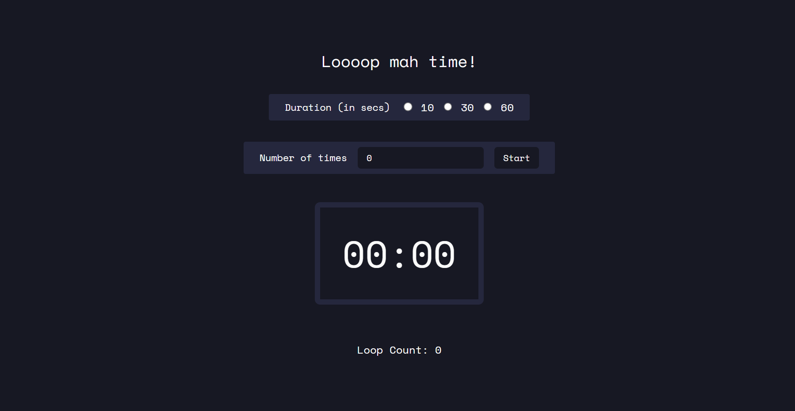

# Countdown Timer Loop

### Summary

This project is a simple countdown timer loop that allows users to set the number of seconds (10, 30, or 60) and the number of times the timer should loop. It provides a convenient way to manage repetitive tasks or activities with predefined time intervals.

### Live Demo

Experience the countdown timer loop in action by visiting the [live application](https://aditi002-holo.github.io/countdown-timer-loop/).

### Stack Used

- HTML
- CSS
- TypeScript

### Features

- Set the countdown timer duration (10, 30, or 60 seconds).
- Specify the number of times the timer should loop.
- Clean and user-friendly interface.

### Usage

1. Open the [live application](https://aditi002-holo.github.io/countdown-timer-loop/).
2. Input the desired countdown duration (10, 30, or 60 seconds).
3. Enter the number of times you want the timer to loop.
4. Click the "Start" button to initiate the countdown loop.
5. The timer will run for the specified duration, and upon completion, it will reset and repeat based on the specified loop count.

### Author

- Aditi Deshpande